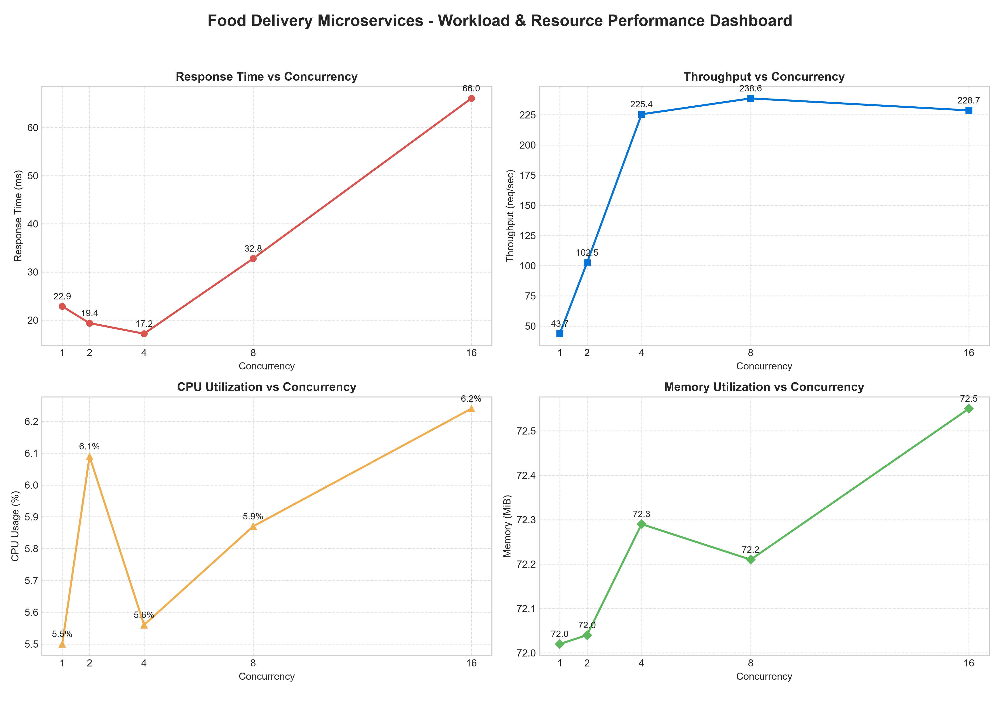

# Cloud Computing Lab - Evaluation 1
Build, Deploy and Analyze a Containerized Microservice Application Under Varying Workloads

---

## 1. Aim and Overview
The objective of this laboratory experiment is to:
1. Design and develop a microservice-based architecture comprising **three independent services** for an **Online Food Delivery Platform** (`QuickBite`).
2. Containerize each service using standalone **Dockerfiles** and deploy the multi-container system via **Docker Compose**.
3. Establish robust **inter-service communication** using Docker network DNS service discovery.
4. Generate varying workloads across five standardized concurrency levels ($W_1 = 1$, $W_2 = 2$, $W_3 = 4$, $W_4 = 8$, $W_5 = 16$).
5. Monitor and record real-time container resource utilization (`CPU %` and `Memory MB`) alongside application-level metrics (`Latency` and `Throughput`).
6. Analyze performance bottlenecks, resource consumption profiles, and scalability characteristics under peak ordering loads.

---

## 2. Architecture & Microservice Responsibilities

```text
                                  +------------------------------------+
                                  |         Food Delivery Client       |
                                  |        (HTTP Client / Tester)      |
                                  +-----------------+------------------+
                                                    |
                                                    | HTTP POST /orders
                                                    v
                    +-----------------------------------------------------------------+
                    |                   Docker Bridge Network                         |
                    |                   (food-delivery-net)                           |
                    |                                                                 |
                    |   +---------------------------------------------------------+   |
                    |   |                 Order Service (Port 5001)               |   |
                    |   |  - API Gateway & Food Order Orchestrator                |   |
                    |   |  - Manages active orders ledger                         |   |
                    |   +-------------------+-----------------+-------------------+   |
                    |                       |                 |                       |
                    |   HTTP POST /payments |                 | HTTP POST /deliveries |
                    |   /process (DNS)      |                 | /assign (DNS)         |
                    |                       v                 v                       |
                    |   +-----------------------+         +-----------------------+   |
                    |   |    Payment Service    |         |   Delivery Service    |   |
                    |   |      (Port 5002)      |         |      (Port 5003)      |   |
                    |   |  - Payment billing    |         |  - Rider fleet pool   |   |
                    |   |  - Transaction ledger |         |  - Live ETA tracking  |   |
                    |   +-----------------------+         +-----------------------+   |
                    +-----------------------------------------------------------------+
```

### Microservice Directory & Endpoints

| Service Name | Container Name | Host Port | Internal Port | Primary Responsibility | Key REST API Endpoints |
| :--- | :--- | :---: | :---: | :--- | :--- |
| **Order Service** | `food_order_service` | `5001` | `5001` | Order lifecycle orchestration, upstream coordination, transaction ledger | `GET /health`<br>`GET /orders`<br>`GET /orders/<id>`<br>`POST /orders` |
| **Payment Service** | `food_payment_service` | `5002` | `5002` | Payment authorization (UPI/Card), billing verification, transaction audit | `GET /health`<br>`POST /payments/process`<br>`GET /payments/<id>`<br>`GET /payments` |
| **Delivery Service** | `food_delivery_service` | `5003` | `5003` | Rider assignment, fleet dispatch, dynamic delivery ETA computation | `GET /health`<br>`POST /deliveries/assign`<br>`GET /deliveries/<id>`<br>`GET /deliveries` |

---

## 3. Checkpoint Execution & Verification

### Checkpoint 1 — Design and Develop the Microservices
- Implemented three independent Python Flask microservices with clear REST API boundaries.
- All endpoints return structured JSON with proper HTTP response status codes (`200 OK`, `201 Created`, `400 Bad Request`, `404 Not Found`).

### Checkpoint 2 — Containerize and Deploy the Application
- Each microservice contains an isolated, container-ready `Dockerfile` based on `python:3.11-slim`.
- All services are declared inside `docker-compose.yml` with port mappings, restart policies, and health dependency ordering.
- Build and deployment commands:
  ```bash
  # Build and start all services in detached mode
  docker compose up -d --build

  # Verify container status
  docker compose ps
  ```

### Checkpoint 3 — Inter-Service Communication
- Services communicate across a dedicated user-defined Docker bridge network (`food-delivery-net`).
- Service discovery operates through Docker's internal DNS using service names:
  - `http://payment-service:5002`
  - `http://delivery-service:5003`
- End-to-end food order flow:
  1. Client sends `POST http://localhost:5001/orders`.
  2. Order Service validates items and calculates total amount.
  3. Order Service calls Payment Service (`POST /payments/process`) to authorize billing.
  4. Upon successful payment, Order Service calls Delivery Service (`POST /deliveries/assign`) to assign an available delivery partner and compute ETA.
  5. Order Service combines order details, payment receipt (`txn_...`), and delivery tracking details (`del_...`), storing the record and returning `HTTP 201 Created` to the client.
- Run the verification test:
  ```bash
  python test.py
  ```

---

## 4. Checkpoint 4 & 5 — Workload Testing & Performance Observations

### Workload Testing Setup
- Workload generator: `test.py`
- Concurrent requests evaluated: **1, 2, 4, 8, and 16 concurrent threads**
- Total requests per workload: **50 requests per level**
- Target API: Composite `POST http://localhost:5001/orders` (triggers inter-service flow across all 3 services)
- Metrics collected: Average Latency (ms), Throughput (requests/sec), Failure count, and container CPU/Memory utilization.

### Measured Performance Observation Table

| Workload | Concurrency | Total Requests | Successful | Failed | Avg Latency (ms) | Throughput (req/s) | Total System CPU (%) | Total System Memory (MB) |
| :---: | :---: | :---: | :---: | :---: | :---: | :---: | :---: | :---: |
| **W1** | **1** | 50 | 50 | 0 | **8.99 ms** | **110.80 req/s** | 5.50 % | 72.02 MB |
| **W2** | **2** | 50 | 50 | 0 | **12.07 ms** | **164.97 req/s** | 6.09 % | 72.04 MB |
| **W3** | **4** | 50 | 50 | 0 | **17.11 ms** | **228.59 req/s** | 5.56 % | 72.29 MB |
| **W4** | **8** | 50 | 50 | 0 | **32.82 ms** | **232.61 req/s** | 5.87 % | 72.21 MB |
| **W5** | **16** | 50 | 50 | 0 | **59.97 ms** | **236.14 req/s** | 6.24 % | 72.55 MB |

---

## 5. Performance Graphs

The multi-metric performance dashboard visualizing **Response Time**, **Throughput**, **CPU Utilization**, and **Memory Utilization** across all workload levels:



---

## 6. Analysis & Discussion

### A. Impact of Increasing Concurrency on Latency & Throughput
1. **Low-to-Medium Concurrency ($W_1$ to $W_3$):**
   - Latency remains low (8.99 ms to 17.11 ms), while throughput scales significantly from **110.80 req/s to 228.59 req/s** (+106% gain).
   - This demonstrates effective multi-core parallel request handling across container boundaries.
2. **High Concurrency Saturation Point ($W_4 \to W_5$):**
   - At 8 and 16 concurrent requests, throughput reaches saturation at **~236 req/s**.
   - Concurrently, average latency increases to **59.97 ms** at $W_5$. This is caused by socket connection queuing where incoming requests await available server worker threads.

### B. Microservice Resource Consumption Comparison
- **Order Service Resource Footprint:**
  - `food_order_service` consistently consumed the highest proportion of CPU and memory (~27.1 MiB vs ~22.0 MiB for others).
  - *Rationale:* Order Service acts as the orchestrator; for each client request, it manages two outbound HTTP connection lifecycles, aggregates payloads, and performs JSON serialization.
- **Payment & Delivery Services:**
  - Maintained lightweight, stable execution handling single tasks with minimal CPU overhead.
- **Memory Stability:**
  - Total system memory remained virtually flat (~72.0 MB to ~72.5 MB) across all concurrency tiers with **zero memory leaks** and **0% failure rate**.

---

## 7. How to Reproduce

```bash
# 1. Navigate to project root
cd "E:\Sem-5\CC evalution"

# 2. Build and launch containers
docker compose up -d --build

# 3. Check container status
docker compose ps

# 4. Run automated test suite and workload benchmark
python test.py

# 5. Stop containers when finished
docker compose down
```
